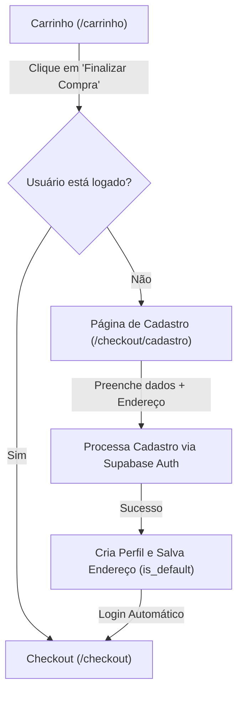

# Fluxo de Cadastro Simplificado no Checkout

Este documento detalha o planejamento, fluxo de navegação e as alterações no banco de dados necessárias para a implementação da funcionalidade de cadastro obrigatório durante o checkout para usuários não autenticados.

---

## 1. Visão Geral do Fluxo

Quando um usuário tenta fechar uma compra a partir do carrinho, o sistema deve verificar se ele está logado. Se não estiver, ele é redirecionado para um fluxo de cadastro rápido que coleta as informações necessárias para faturamento e entrega (Asaas e split de pagamento), persistindo esses dados de forma segura.

### Diagrama de Navegação



---

## 2. Alterações e Modelagem do Banco de Dados (PostgreSQL / Supabase)

Para persistir os dados de telefone, CPF e endereço dos consumidores, precisamos atualizar a estrutura do banco de dados no Supabase.

### 2.1 Alterações na Tabela `users`
Precisamos adicionar as colunas de telefone e CPF para consumidores. A tabela `vendors` já possui `cpf_cnpj`, mas a tabela pública `users` precisa armazenar os dados do consumidor final.

```sql
-- Adiciona campos de contato e documento na tabela pública de usuários
ALTER TABLE users ADD COLUMN IF NOT EXISTS phone VARCHAR(20);
ALTER TABLE users ADD COLUMN IF NOT EXISTS cpf VARCHAR(14) UNIQUE;
```

### 2.2 Criação da Tabela `user_addresses`
Armazenará múltiplos endereços dos usuários, permitindo que eles salvem e definam um como padrão.

```sql
CREATE TABLE IF NOT EXISTS user_addresses (
    id UUID PRIMARY KEY DEFAULT uuid_generate_v4(),
    user_id UUID REFERENCES users(id) ON DELETE CASCADE NOT NULL,
    zip_code VARCHAR(10) NOT NULL,            -- CEP
    street VARCHAR(255) NOT NULL,             -- Rua/Avenida
    number VARCHAR(20) NOT NULL,              -- Número
    complement VARCHAR(100),                  -- Complemento (Apto, bloco, etc.)
    neighborhood VARCHAR(100) NOT NULL,       -- Bairro
    city VARCHAR(100) NOT NULL,               -- Cidade
    state VARCHAR(2) NOT NULL,                -- UF (Estado)
    is_default BOOLEAN NOT NULL DEFAULT FALSE,-- Define se é o endereço padrão
    created_at TIMESTAMP WITH TIME ZONE DEFAULT TIMEZONE('utc'::text, NOW()) NOT NULL
);
```

### 2.3 Regras de Segurança (Row Level Security - RLS)
Garantimos que cada usuário só consiga ver e gerenciar os seus próprios endereços.

```sql
-- Habilitar RLS na tabela
ALTER TABLE user_addresses ENABLE ROW LEVEL SECURITY;

-- Política de Leitura (Select)
CREATE POLICY "Usuários visualizam apenas seus próprios endereços" ON user_addresses
    FOR SELECT USING (auth.uid() = user_id);

-- Política de Inserção (Insert)
CREATE POLICY "Usuários cadastram seus próprios endereços" ON user_addresses
    FOR INSERT WITH CHECK (auth.uid() = user_id);

-- Política de Atualização (Update)
CREATE POLICY "Usuários atualizam seus próprios endereços" ON user_addresses
    FOR UPDATE USING (auth.uid() = user_id) WITH CHECK (auth.uid() = user_id);

-- Política de Exclusão (Delete)
CREATE POLICY "Usuários removem seus próprios endereços" ON user_addresses
    FOR DELETE USING (auth.uid() = user_id);
```

### 2.4 Trigger para Unicidade do Endereço Padrão
Sempre que um endereço for marcado como padrão (`is_default = true`), os outros endereços do mesmo usuário devem ser desmarcados automaticamente.

```sql
CREATE OR REPLACE FUNCTION handle_default_address()
RETURNS TRIGGER AS $$
BEGIN
    IF NEW.is_default = TRUE THEN
        UPDATE user_addresses
        SET is_default = FALSE
        WHERE user_id = NEW.user_id AND id <> NEW.id;
    END IF;
    RETURN NEW;
END;
$$ LANGUAGE plpgsql;

CREATE TRIGGER trigger_set_default_address
BEFORE INSERT OR UPDATE ON user_addresses
FOR EACH ROW
EXECUTE FUNCTION handle_default_address();
```

---

## 3. Detalhamento da Tela de Cadastro (/checkout/cadastro)

A nova página de cadastro será implementada no módulo cliente: `apps/web/src/app/checkout/cadastro/page.tsx`.

### 3.1 Campos do Formulário
O formulário será dividido em duas partes visuais claras (Dados Pessoais e Endereço de Entrega) para melhorar a experiência do usuário.

1. **Dados Pessoais**:
   * **Nome Completo** (Obrigatório) -> Salva em `users.name`
   * **E-mail** (Obrigatório, validação de formato) -> Login e `users.email`
   * **Telefone** (Obrigatório, máscara de celular `(99) 99999-9999`) -> Salva em `users.phone`
   * **CPF** (Obrigatório, validação de algoritmo de CPF e máscara `999.999.999-99`) -> Salva em `users.cpf`
   * **Senha** (Obrigatório, mínimo de 6 caracteres) -> Usada no cadastro de autenticação.

2. **Endereço de Entrega**:
   * **CEP** (Obrigatório, busca automática via API ViaCEP ao preencher)
   * **Logradouro/Rua** (Obrigatório)
   * **Número** (Obrigatório)
   * **Complemento** (Opcional)
   * **Bairro** (Obrigatório)
   * **Cidade** (Obrigatório)
   * **Estado/UF** (Obrigatório, limite de 2 caracteres)
   * **Checkbox**: `"Salvar como endereço de entrega padrão"` (Marca `is_default` como `true` ou `false`)

---

## 4. Fluxo Técnico de Persistência no Frontend

Ao submeter o formulário de cadastro, o frontend executará os seguintes passos de maneira transacional na perspectiva do cliente:

1. **Validação de Campos**: Verifica CPF (algoritmo), senhas iguais, formatos de e-mail e preenchimento de campos obrigatórios.
2. **Criação da Conta (Supabase Auth)**:
   ```typescript
   const { data, error } = await supabase.auth.signUp({
     email,
     password,
     options: {
       data: {
         name,
         type: 'CONSUMER'
       }
     }
   });
   ```
3. **Atualização do Perfil Público**:
   Como a trigger insere o usuário automaticamente com base no `signUp`, fazemos uma atualização para salvar o `phone` e o `cpf`:
   ```typescript
   await supabase
     .from('users')
     .update({ phone, cpf })
     .eq('id', data.user.id);
   ```
4. **Inserção do Endereço**:
   Insere o endereço na tabela `user_addresses` vinculando-o ao ID do usuário recém-criado:
   ```typescript
   await supabase
     .from('user_addresses')
     .insert({
       user_id: data.user.id,
       zip_code,
       street,
       number,
       complement,
       neighborhood,
       city,
       state,
       is_default // boolean do checkbox
     });
   ```
5. **Redirecionamento**:
   Com a sessão ativa no Supabase (o `signUp` inicia a sessão automaticamente na configuração padrão), o usuário é imediatamente redirecionado para a página de `/checkout` para concluir seu pagamento.
