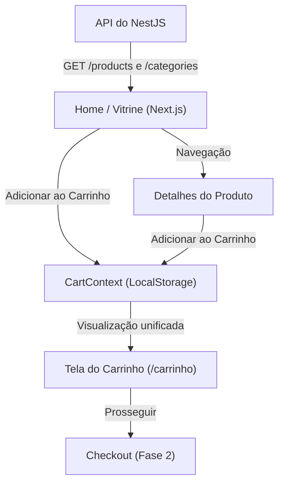

# Plano de Ação: Vitrine de Produtos & Carrinho Unificado

Este documento detalha o planejamento para a implementação da visão do consumidor no e-commerce Ofertix. O objetivo é construir uma interface de navegação fluida e um carrinho de compras que agrupe produtos de múltiplos vendedores, preparando a aplicação para a etapa subsequente de split de pagamentos.

---

## 1. Escopo das Funcionalidades

### A. Backend (NestJS)
* **Busca Textual de Produtos**: Ajustar o endpoint de listagem de produtos (`GET /products`) para suportar um parâmetro de busca textual (`?search=...`) utilizando a query `ilike` do PostgreSQL/Supabase.

### B. Frontend (Next.js)
1. **Contexto de Estado do Carrinho (`CartContext`)**:
   * Gerenciador de estado global persistido no `LocalStorage` do navegador.
   * Funções: `addItem`, `removeItem`, `updateQuantity`, `clearCart` e contadores de itens.
2. **Vitrine Principal (Página `/`)**:
   * Substituir a página inicial padrão do Next.js por uma vitrine de marketplace moderna.
   * Componentes: Header global (busca, categorias, indicador de carrinho), banner promocional premium, carrossel de categorias e grid de produtos com hover cards interativos.
3. **Página de Detalhes do Produto (`/produtos/[id]`)**:
   * Exibição das informações completas de um produto.
   * Galeria de fotos com seleção de imagens, card de informações sobre o vendedor e seletor de quantidade para inserção no carrinho.
4. **Página do Carrinho Unificado (`/carrinho`)**:
   * Listagem de todos os itens do carrinho agrupados por vendedor (destacando a origem de cada produto).
   * Ajuste dinâmico de quantidade e remoção de itens com atualização em tempo real de subtotais e totais.
   * Cálculo de frete único simulado de R$ 15,00 e resumo financeiro.

---

## 2. Cronograma e Passos de Desenvolvimento

### Passo 1: Ajuste do Backend NestJS
* **Arquivo**: [products.service.ts](file:///C:/Users/heros/Documents/Prs/Ofertix/apps/api/src/modules/products/products.service.ts)
* **Ação**: Implementar o filtro opcional `search` na consulta do Supabase.
* **Arquivo**: [products.controller.ts](file:///C:/Users/heros/Documents/Prs/Ofertix/apps/api/src/modules/products/products.controller.ts)
* **Ação**: Passar o parâmetro `@Query('search')` do controller para o service.

### Passo 2: Contexto do Carrinho no Next.js
* **Arquivo**: `apps/web/src/lib/cart-context.tsx` (a ser criado)
* **Ação**: Implementar o context React, tipagens do item do carrinho e a persistência no `localStorage`.
* **Arquivo**: [layout.tsx](file:///C:/Users/web/src/app/layout.tsx)
* **Ação**: Envolver a aplicação no `CartProvider`.

### Passo 3: Componente do Header e Layout do Cliente
* **Arquivo**: `apps/web/src/components/layout/header.tsx` (a ser criado)
* **Ação**: Criar uma barra de navegação responsiva com barra de pesquisa, seletor de categorias, link para login/painel de vendedor e um ícone de carrinho interativo com badge dinâmico de contagem de itens.

### Passo 4: Vitrine Principal (Página `/`)
* **Arquivo**: [page.tsx](file:///C:/Users/heros/Documents/Prs/Ofertix/apps/web/src/app/page.tsx)
* **Ação**: Desenvolver o layout da Home integrado com a API do NestJS para exibir dinamicamente categorias e produtos.

### Passo 5: Detalhes do Produto (`/produtos/[id]`)
* **Arquivo**: `apps/web/src/app/produtos/[id]/page.tsx` (a ser criado)
* **Ação**: Página dinâmica que busca os detalhes do produto do backend no servidor e monta a página de compra client-side.

### Passo 6: Tela de Visualização do Carrinho (`/carrinho`)
* **Arquivo**: `apps/web/src/app/carrinho/page.tsx` (a ser criado)
* **Ação**: Página com agrupamento visual dos itens por loja (vendedor), edição de quantidade e o resumo financeiro com frete simulado.

---

## 3. Design & Estética Visual (Rich Aesthetics)

Para garantir um visual premium e moderno:
* **Gradients**: Uso de gradientes sutis nos banners e hovers (ex: `from-slate-900 to-indigo-950` para fundos escuros e `indigo-600` para destaques).
* **Grid Layouts**: Layouts fluidos usando CSS Grid e flexbox que se adaptam perfeitamente do celular ao monitor ultra-wide.
* **Componentes Interativos**: Cards de produtos com zoom suave na imagem em hover, botões de adicionar ao carrinho com animação de transição, e alertas/badgets de status bem estilizados.
* **Tipografia**: Utilização de famílias tipográficas modernas (sans-serif limpas) e pesos contrastantes para hierarquia visual.
